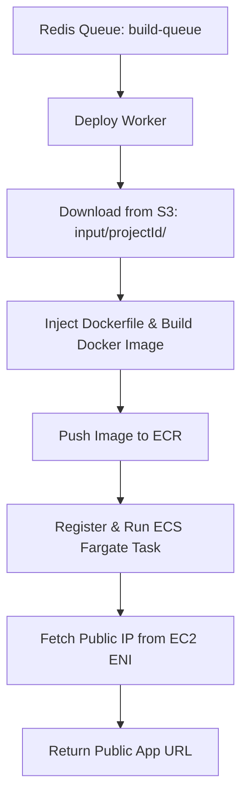

# DeployX

DeployX is a Vercel-like platform that enables seamless deployment of frontend apps directly from GitHub. It uses a microservice-based architecture to support scalable, asynchronous, and secure deployments using AWS services.

---

## System Architecture

### Services

| Service                  | Role                                                                 |
|--------------------------|----------------------------------------------------------------------|
| `deployx-upload-service` | Clones GitHub repo, stores data in s3, pushes job metadata to a Redis queue|
| `deployx-deploy-service` | Processes jobs from Redis queue, creates Docker file and builds app, uploads to ECR and deploys ECS|
| `deployx-request-handler`| Serves built apps from S3 based on unique project IDs (this was when it was just serving static files from S3. Not the case anymore)|

---

## Design Rationale

The reason the **upload** and **deploy** services are separated is because the deploy service is significantly more computationally expensive. It handles Docker builds, ECR pushes, and ECS deployments — all of which take time and resources. By decoupling the two, the upload service can respond quickly to user input, while the deploy service processes jobs asynchronously in the background. This separation allows the deploy service to scale independently and ensures a smoother, more responsive experience for users.

## 1. Upload Service

### Purpose
1. Clones GitHub repo 
2. Uploads source code to S3
3. Push job to Redis queue.

### Flow

```text
User provides GitHub repo URL
  ↓
Clone repo using simple-git
  ↓
Upload folder to S3 using directory like structure (S3 does not have actual folders, just appears like it does)
  ↓
Pushes into the Redis "build-queue": { projectId }
```

### Components

- `index.ts`: Clones repo, uploads it to S3, sends Redis message.
- `utils.ts`: Generates random project IDs.
- `aws.ts`: Uploads folder to S3.

---

## 2. Deploy Service

### Purpose
1. Listens for events on the Redis queue and downloads project folder from S3 to local disk
2. Creates a Dockerfile dynamically
3. Injects the Dockerfile into the project folder and builds the image locally
5. Tags and pushes the Docker image to AWS ECR
6. Deploys the image to ECS Fargate with a public IP
7. Returns publically accesible link to website

### Flow

```text
Poll Redis queue for deployment job
  ↓
Download project files from S3
  ↓
Inject Dockerfile and build Docker image locally
  ↓
Tag and push Docker image to ECR
  ↓
Register ECS task and launch it on Fargate
  ↓
Retrieve and return public IP of running container
```

### Components

- `index.ts`: Redis-based job queue consumer; orchestrates the entire deploy flow.
- `utils.ts`: : Finds the project root and injects Dockerfile; builds the Docker image.
- `ecsRunner.ts`: Registers and deploys ECS Fargate tasks with image URI.
- `aws.ts`:  Downloads raw project from S3. (used to also upload finished build for static serving but I extended the project to run on ECS)
---

## 3. Request Handler

Does not do anything right now after project was extended

---


## AWS Services Used

| AWS Service     | Role                                  |
|----------------|----------------------------------------|
S3               | Store raw uploaded project files (from Upload Service)
ECR              | Store Docker images built locally before ECS deployment
ECS Fargate      | Run deployed containerized web apps with assigned public IPs
EC2 (ENI)        | Used indirectly to fetch the public IP of running ECS tasks
IAM              | Manages permissions for ECS, ECR, and S3 operations
Redis            | Acts as a job queue (via build-queue) for async task processing

---


## System Overview



---


